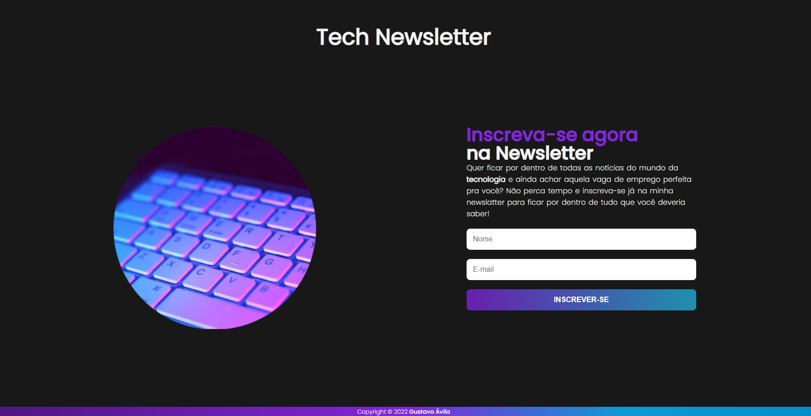

A modern and responsive landing page designed to promote subscriptions to a **technology-focused newsletter**.

## 🌐 Overview

This page was built with a clean design, great usability, and responsive layout in mind. Its goal is to attract users interested in technology news and job opportunities.



## ✨ Features

- 📱 **Responsive layout**: fits all screen sizes
- 🎨 **Modern UI**: gradients, custom fonts, and styled scrollbars
- 📩 **Subscription form**: captures user name and email

## 📁 Project Structure

```
.
├── estilo/
│   ├── fonts.css
│   ├── media.css
│   └── style.css
├── imagens/
│   ├── teclado.webp
│   └── preview.png
├── index.html
└── LICENSE
```

## 🛠️ Built With

- HTML5
- CSS3
- Google Fonts (Poppins)
- Responsive design using media queries

## 🚀 How to Run

1. Clone the repository:
   ```bash
   git clone https://github.com/your-username/repository-name.git
   ```
2. Open the `index.html` file in your browser.

## 🧑‍💻 Author

Developed by [Gustavo Ávila](https://www.instagram.com/gus__avila/)

## 📝 License

This project is licensed under the [MIT License](./LICENSE).